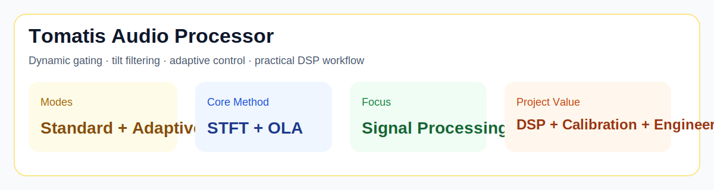
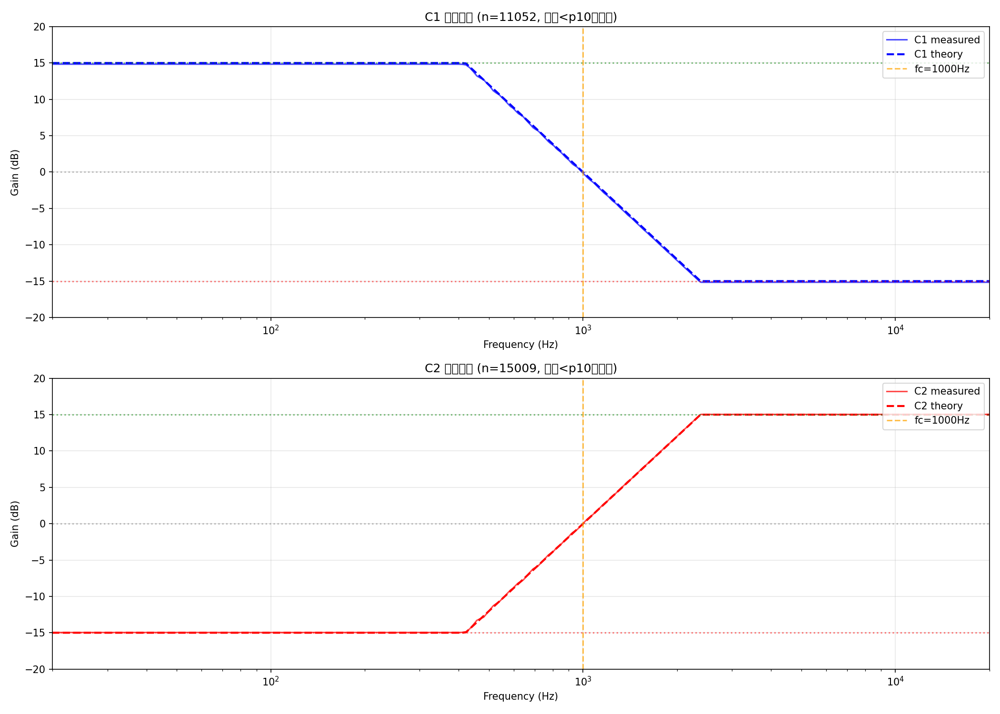
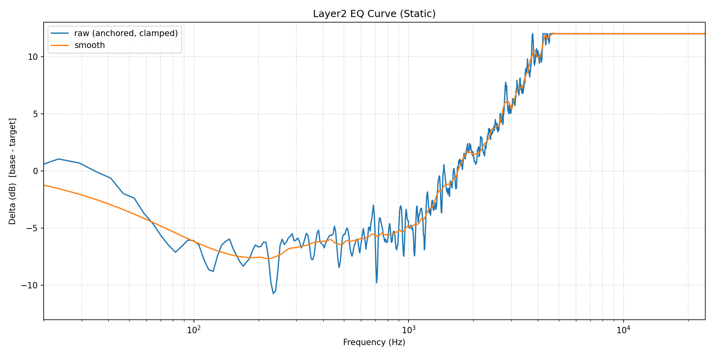

# Tomatis Audio Processor / Tomatis 音频处理器


## At a glance / 项目速览

| Item | Summary |
|------|---------|
| Task | Tomatis-style audio processing / Tomatis 风格音频处理 |
| Core ideas | Dynamic gating, tilt filtering, adaptive control |
| Technical stack | Python, NumPy, SciPy, SoundFile |
| Project value | DSP experimentation, calibration, practical audio engineering |



### Visual snapshot / 可视化结果

| Adaptive Spectrum | EQ Curve |
|-------------------|----------|
|  |  |

A Python-based audio processing system inspired by Tomatis-style dynamic gated filtering, designed around signal-processing analysis, calibration, and practical experimentation.

一个基于 Python 的 Tomatis 风格音频处理系统，核心是动态门控滤波、频域增益控制和面向真实音频实验的校准流程。

---

## Overview / 项目概述

This project started as an attempt to reproduce and experiment with Tomatis-like audio processing behavior in software.

这个项目最初的目标，是把类似 Tomatis 设备的处理逻辑用软件方式复现出来，并进一步支持可调参数、批量实验和音质优化。

It is more than a simple filter implementation:
- dynamic gating between different processing states
- tilt-style frequency shaping
- adaptive parameter tuning
- practical engineering for long audio files and boundary handling

它不只是一个简单滤波器，而是一整套：
- 动态门控状态切换
- 倾斜式频率增益控制
- 自适应参数优化
- 面向长音频和真实边界问题的工程处理

---

## Core Capabilities / 核心能力

### 1. Dynamic gating / 动态门控
The processor switches between different filter states based on input signal level.

处理器会根据输入音频电平在不同滤波状态之间切换，以模拟更动态的听觉处理行为。

### 2. Tilt filtering / 倾斜滤波
Frequency-dependent gain shaping is applied to emphasize or suppress different frequency regions.

在频域中对不同频率段做倾斜式增益控制，从而实现低频/高频的动态强调与抑制。

### 3. Adaptive mode / 自适应模式
In addition to a more device-like mode, the project includes an adaptive variant for smoother transitions and threshold optimization.

除了更接近设备复刻的模式外，这个项目还包含自适应版本，用于改善切换平滑性并自动优化阈值。

### 4. Signal-processing engineering / 信号处理工程细节
The implementation includes practical handling for:
- STFT + OLA processing
- boundary padding
- clipping avoidance
- transition smoothing
- long-file processing workflows

实现中包含大量真实工程细节，例如：
- STFT + OLA
- 边界 padding
- 防止削波
- 平滑过渡
- 长音频处理流程

---

## Technical Stack / 技术栈

- Python 3.11+
- NumPy
- SciPy
- SoundFile
- Librosa
- Pandas
- Matplotlib

---

## Basic Usage / 基本用法

### Standard mode / 标准模式
```bash
python src/process_tomatis.py -i input.flac -o output.flac --gate_ui 50
```

### Adaptive mode / 自适应模式
```bash
python src/process_tomatis_adaptive.py -i input.flac -o output.flac
```

---

## Why this repository is interesting / 为什么这个项目值得看

This project is a good example of work that sits between:
- DSP experimentation
- reverse-engineering style thinking
- practical Python implementation
- iterative calibration and debugging

这个项目比较有辨识度，因为它处在下面几个方向的交叉点：
- 数字信号处理实验
- 类逆向工程式的分析思路
- Python 工程实现
- 反复校准和调参的实践过程

It shows how I approach systems that are not fully specified upfront: I test behavior, compare outputs, refine assumptions, and gradually turn that into a working implementation.

它体现了我处理“规范不完整系统”的方式：先观察行为、做对比、修正假设，再逐步把它沉淀成可运行实现。

---

## Repository Structure / 仓库结构

```text
src/         # core processing logic
scripts/     # utility and analysis scripts
docs/        # technical notes and work logs
analysis/    # experiment outputs and supporting analysis
audio/       # local audio assets (not all suitable for publication)
```

---

## Documentation / 文档

- `docs/Tomatis处理器使用指南.md`
- `docs/Tomatis技术说明.md`
- `docs/TOMATIS_WORK_LOG.md`

These documents capture the algorithm intuition, parameter choices, and implementation evolution.

这些文档记录了算法思路、参数设计和项目演进过程。

---

## Reproducibility / 复现说明

This repository is best viewed as a project-and-experiment repository rather than a polished library package.

本仓库更适合作为一个“项目 + 实验记录”仓库来理解，而不是已经彻底产品化的库。

If I continue refining it, the next steps would be:
- cleanly separating reusable processing code from one-off calibration scripts
- adding smaller demo audio samples
- packaging a more consistent CLI interface
- adding tests for core DSP utilities

如果后续继续整理，我会优先：
- 把可复用处理代码和一次性校准脚本拆开
- 增加小型 demo 音频样本
- 统一 CLI 入口
- 为核心 DSP 工具补充测试


---

## Overview / 项目概述

This project started as an attempt to reproduce and experiment with Tomatis-like audio processing behavior in software.

这个项目最初的目标，是把类似 Tomatis 设备的处理逻辑用软件方式复现出来，并进一步支持可调参数、批量实验和音质优化。

It is more than a simple filter implementation:
- dynamic gating between different processing states
- tilt-style frequency shaping
- adaptive parameter tuning
- practical engineering for long audio files and boundary handling

它不只是一个简单滤波器，而是一整套：
- 动态门控状态切换
- 倾斜式频率增益控制
- 自适应参数优化
- 面向长音频和真实边界问题的工程处理

---

## Core Capabilities / 核心能力

### 1. Dynamic gating / 动态门控
The processor switches between different filter states based on input signal level.

处理器会根据输入音频电平在不同滤波状态之间切换，以模拟更动态的听觉处理行为。

### 2. Tilt filtering / 倾斜滤波
Frequency-dependent gain shaping is applied to emphasize or suppress different frequency regions.

在频域中对不同频率段做倾斜式增益控制，从而实现低频/高频的动态强调与抑制。

### 3. Adaptive mode / 自适应模式
In addition to a more device-like mode, the project includes an adaptive variant for smoother transitions and threshold optimization.

除了更接近设备复刻的模式外，这个项目还包含自适应版本，用于改善切换平滑性并自动优化阈值。

### 4. Signal-processing engineering / 信号处理工程细节
The implementation includes practical handling for:
- STFT + OLA processing
- boundary padding
- clipping avoidance
- transition smoothing
- long-file processing workflows

实现中包含大量真实工程细节，例如：
- STFT + OLA
- 边界 padding
- 防止削波
- 平滑过渡
- 长音频处理流程

---

## Technical Stack / 技术栈

- Python 3.11+
- NumPy
- SciPy
- SoundFile
- Librosa
- Pandas
- Matplotlib

---

## Basic Usage / 基本用法

### Standard mode / 标准模式
```bash
python src/process_tomatis.py -i input.flac -o output.flac --gate_ui 50
```

### Adaptive mode / 自适应模式
```bash
python src/process_tomatis_adaptive.py -i input.flac -o output.flac
```

---

## Why this repository is interesting / 为什么这个项目值得看

This project is a good example of work that sits between:
- DSP experimentation
- reverse-engineering style thinking
- practical Python implementation
- iterative calibration and debugging

这个项目比较有辨识度，因为它处在下面几个方向的交叉点：
- 数字信号处理实验
- 类逆向工程式的分析思路
- Python 工程实现
- 反复校准和调参的实践过程

It shows how I approach systems that are not fully specified upfront: I test behavior, compare outputs, refine assumptions, and gradually turn that into a working implementation.

它体现了我处理“规范不完整系统”的方式：先观察行为、做对比、修正假设，再逐步把它沉淀成可运行实现。

---

## Repository Structure / 仓库结构

```text
src/         # core processing logic
scripts/     # utility and analysis scripts
docs/        # technical notes and work logs
analysis/    # experiment outputs and supporting analysis
audio/       # local audio assets (not all suitable for publication)
```

---

## Documentation / 文档

- `docs/Tomatis处理器使用指南.md`
- `docs/Tomatis技术说明.md`
- `docs/TOMATIS_WORK_LOG.md`

These documents capture the algorithm intuition, parameter choices, and implementation evolution.

这些文档记录了算法思路、参数设计和项目演进过程。

---

## Reproducibility / 复现说明

This repository is best viewed as a project-and-experiment repository rather than a polished library package.

本仓库更适合作为一个“项目 + 实验记录”仓库来理解，而不是已经彻底产品化的库。

If I continue refining it, the next steps would be:
- cleanly separating reusable processing code from one-off calibration scripts
- adding smaller demo audio samples
- packaging a more consistent CLI interface
- adding tests for core DSP utilities

如果后续继续整理，我会优先：
- 把可复用处理代码和一次性校准脚本拆开
- 增加小型 demo 音频样本
- 统一 CLI 入口
- 为核心 DSP 工具补充测试
